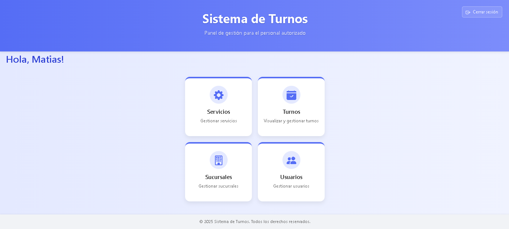
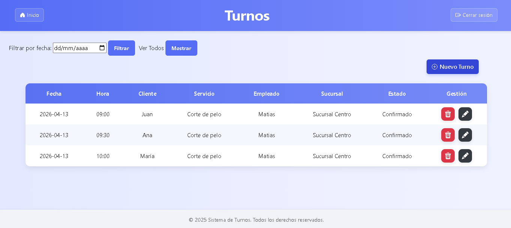
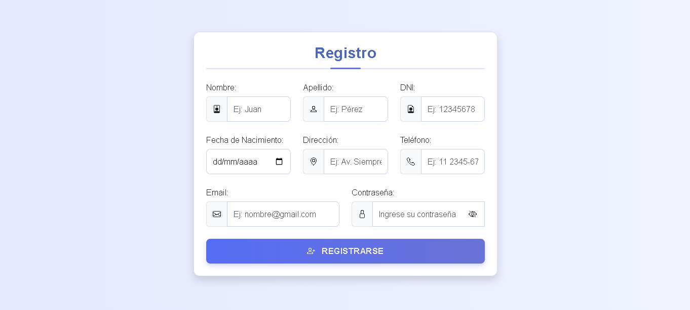

<h1>Sistema de Gestión de Turnos</h1>

Aplicación web para la gestión de turnos que permite a los usuarios registrarse, iniciar sesión y reservar turnos en distintas sucursales según los servicios disponibles.

El sistema contempla distintos roles (cliente, empleado y administrador) y permite la administración de usuarios, sucursales, servicios, días y disponibilidades.

<h2>🎥 Demo</h2>

<a href="https://drive.google.com/file/d/1kOnJD7wS8WQiT2grFmCxO7OjvgCB4Mde/view?usp=drive_link">Ver demostración general del sistema</a>

<a href="https://drive.google.com/file/d/1dceawvckqHAVSyoaLJ8qy_J5emxBZKSy/view?usp=drive_link">Ver mejoras y funcionalidades agregadas</a>

<em>Los videos muestran distintas etapas del desarrollo del sistema.</em>

<h2>📸 Capturas del sistema</h2>

<strong>Vista principal (Empleado)</strong>

<strong>Gestión de turnos (Empleado)</strong>

<strong>Formulario de registro</strong>

<h2>⚙️ Funcionalidades principales</h2>
<ul>
  <li>Registro y autenticación de usuarios con manejo de roles</li>
  <li>Gestión de turnos (alta, baja y modificación)</li>
  <li>Administración de clientes, empleados, sucursales y servicios</li>
  <li>Configuración de días y disponibilidades por sucursal y servicio</li>
  <li>Filtrado dinámico de sucursales y días disponibles en frontend</li>
</ul>

<h2>🧠 Arquitectura y decisiones técnicas</h2>
<ul>
  <li>Arquitectura en capas: Controller, Service, Repository</li>
  <li>Uso de DTOs (Java Records) para la transferencia de datos</li>
  <li>Separación entre controladores MVC y endpoints REST</li>
  <li>Validaciones en backend para garantizar integridad de datos</li>
  <li>Manejo estandarizado de errores en API REST</li>
</ul>

<h2>🛠️ Tecnologías utilizadas</h2>
<ul>
  <li>Java</li>
  <li>Spring Boot (MVC, Data JPA, Security)</li>
  <li>Hibernate</li>
  <li>MySQL</li>
  <li>HTML, CSS, JavaScript</li>
  <li>Bootstrap</li>
  <li>Thymeleaf</li>
  <li>Git y GitHub</li>
</ul>

<h2>🚀 Ejecutar el proyecto</h2>
<ol>
  <li>Clonar el repositorio</li>
  <li>Configurar una base de datos MySQL</li>
  <li>Configurar las credenciales en <strong>application.yml</strong></li>
  <li>Ejecutar la aplicación desde el entorno de desarrollo</li>
</ol>

<h2>👥 Trabajo en equipo</h2>

Proyecto desarrollado en equipo (4 integrantes) en el marco de la materia <strong>Orientación a Objetos 2</strong>.

<h2>📌 Notas</h2>

Proyecto desarrollado con fines educativos, priorizando buenas prácticas, validaciones y una arquitectura escalable.

<h2>👨‍💻 Autores</h2>
<ul>
  <li><a href="https://github.com/camiroldan017">camiroldan017</a></li>
  <li><a href="https://github.com/MicaelaInsfran02">MicaelaInsfran02</a></li>
  <li><a href="https://github.com/LucaasCardozo">LucaasCardozo</a></li>
  <li><a href="https://github.com/LucasEncinas">LucasEncinas</a></li>
</ul>
